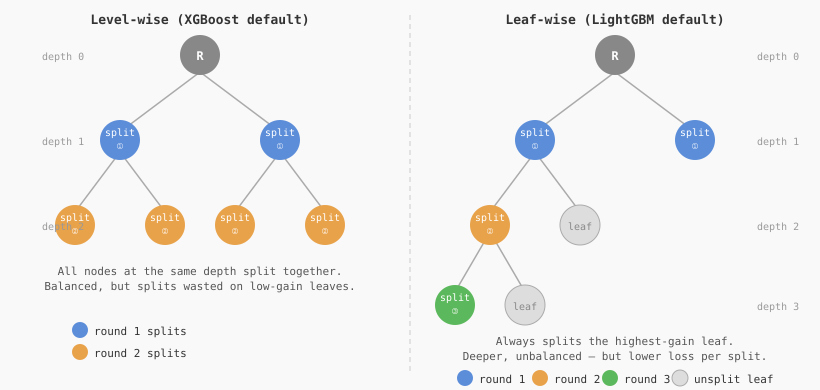
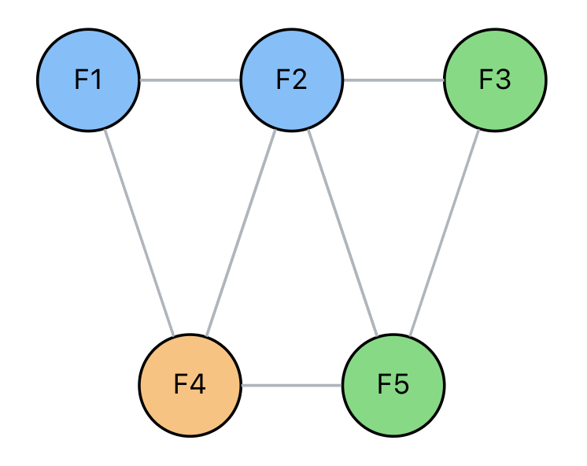
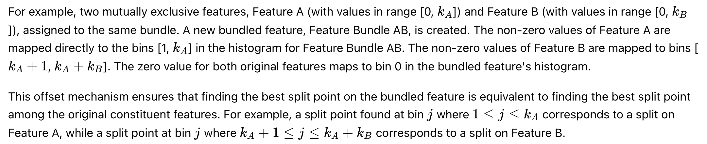
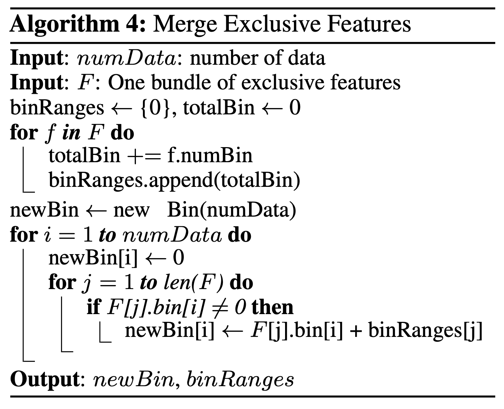

**Training overview**:

While most boosting algorithms use pre-sort-based algorithms (e.g. XGBoost), LightGBM uses histogram-based algorithms 
which bucket continuous features into discrete bins. 

Pre-sorting is simple, but difficult to optimise. Whereas histogram-based algorithms offer these benefits:
1. **Reduced gain calculation at each split**
   2. Pre-sort algorithms have time complexity ```O(n)```
   3. Histogram algorithms have time complexity ```O(bins)```, once the histograms have been initially calculated for
      ```O(n)```. 
   4. ```O(bins)``` is significantly smaller than ```O(n)```
2. **Exploit histogram subtraction for speed-up**
   2. A given leaf's histogram can be derived through histogram subtraction of its parent and neighbour (```parent - neighbour```)
   3. As such, only one leaf's histogram needs to be calculated. And this can be the leaf with the smallest number of rows 
      at the cost of ```O(bins)```.
3. **Reduced memory**
   4. Continuous values are replaced with discrete bins. `uint8_t` may be used if # bins is low.
   5. No additional memory complexity for storing pre-sorting feature values
4. **Reduced communication cost for distributed learning**


Typical decision tree algorithms grow depth-wise/level-by-level/BFS. LGBM grows leaf-wise/best-first/DFS.

Leaf-wise algorithms tend to achieve lower loss but can cause overfitting, remediated by the `max_depth` parameter.




**Training specifics**
1. Exclusive Feature Bundling
   2. an dimensisonality reduction technique that combines sparse (mostly) mutually exclusive features. Preserves information while accelerating training
2. Histogram construction

**Exclusive Feature Bundling**
- High-dimensional datasets, especially with sparse features, pose a challenge for gradient boosting algorithms
- Building histograms at each node split scales with features and so becomes computationally expensive
- The underlying principle behind EHB is that many datasets contain features that rarely, if ever, take non-zero values simultaneously
- A small tolerance, tunable, for conflicts is often allowed since perfect mutual exclusivity may not be possible
  - ``max_conflict_rate`` is the parameter, though this is often handled automatically
- An example of OHE would be: is_london, is_tokyo

LGBM creates a graph whereby:
1. Graph initialisation: Each feature is a node
2. Construct edges: Add edges between feature nodes if they are not mutually exclusive (i.e. two features take a non zero value for a certain number of instances)
3. Graph colouring: Colour each node such that no two connected nodes share the same colour while minimising the number of colours. 
   1. Features sharing the same colour are mutually exclusive enough to be bundled together
   2. Graph colouring is NP-hard, so a greedy algorithm is used

TODO - make claude generate this


Offset mechanism:
- An offset mechanism is used to ensure mappings between unbundled + bundled features
- This makes finding split points between unbundled + bundled features equivalent (ignoring slight perturbances due to conflict allowance)

TODO - Turn this to 




**Optimal split for categoricals:**
- One-hot encoding is sub-optimal for tree learners, particularly in the case of high-cardinality features.
  - Trees built on one-hot features tend to be unbalanced and need to grow deep for high accuracy.
- If a feature has k categories, there are ```2^(k-1) -1``` possible partitions.
- The optimal solution is to split the categories into two subsets. (why??)